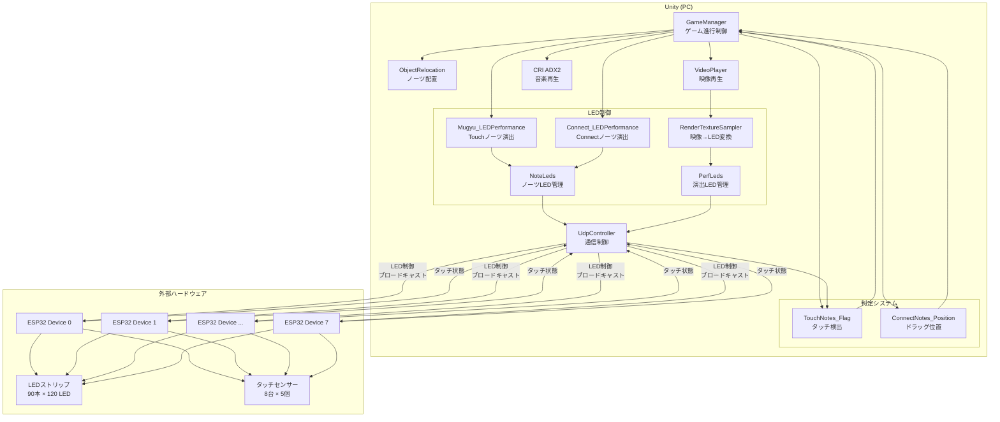
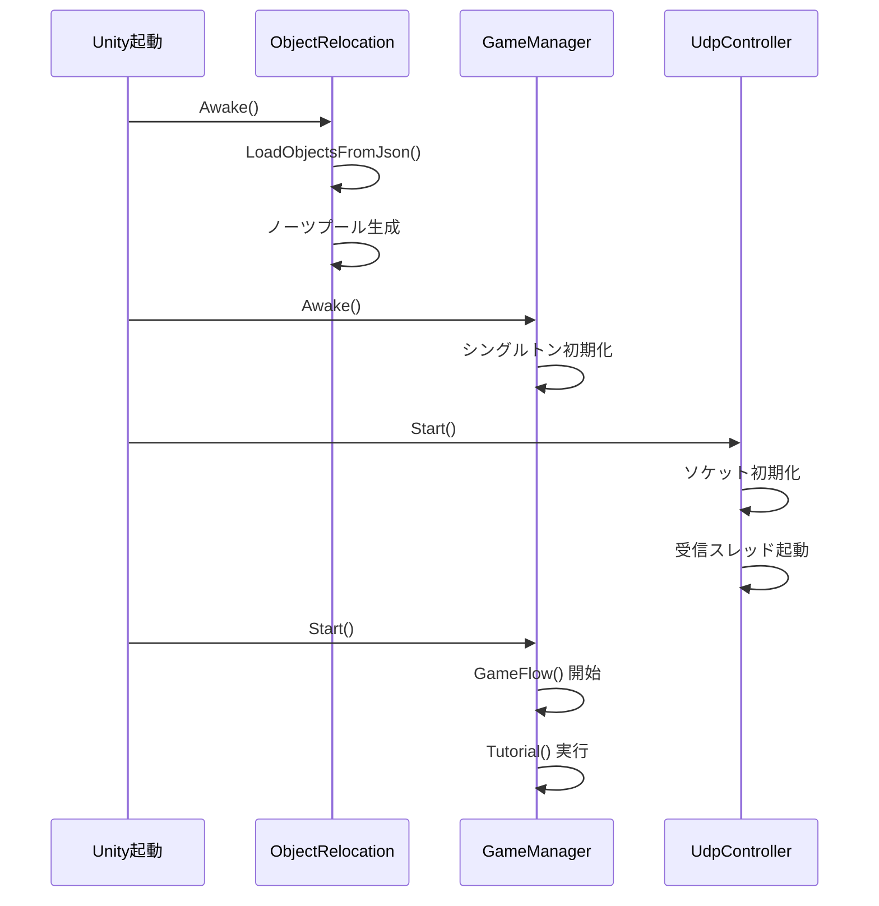
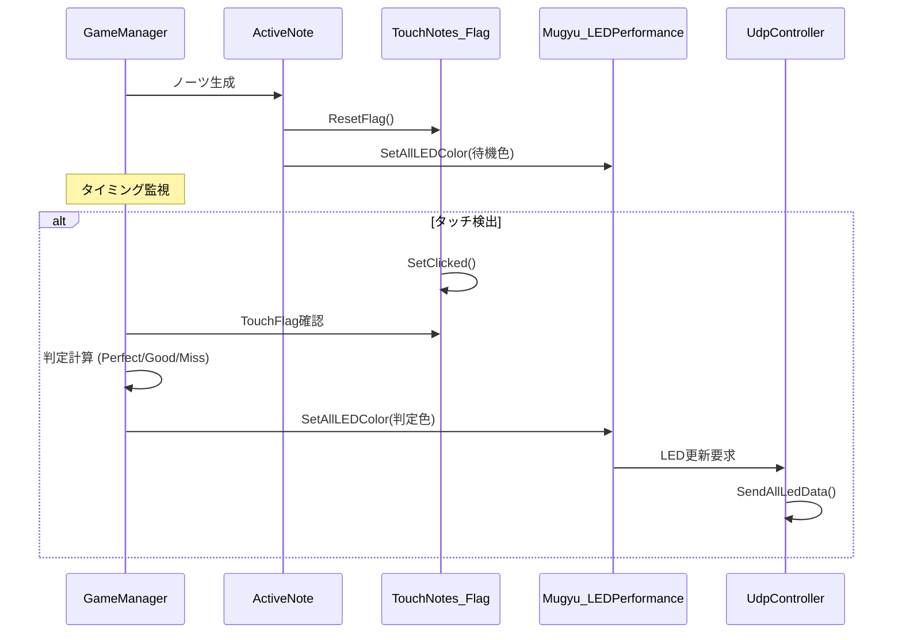
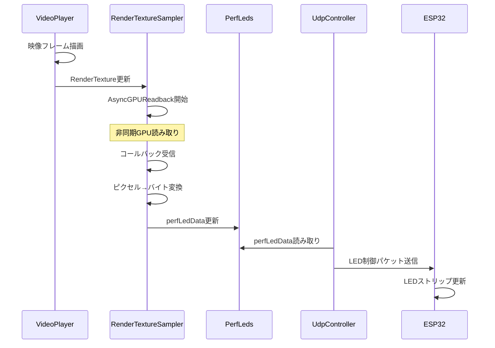
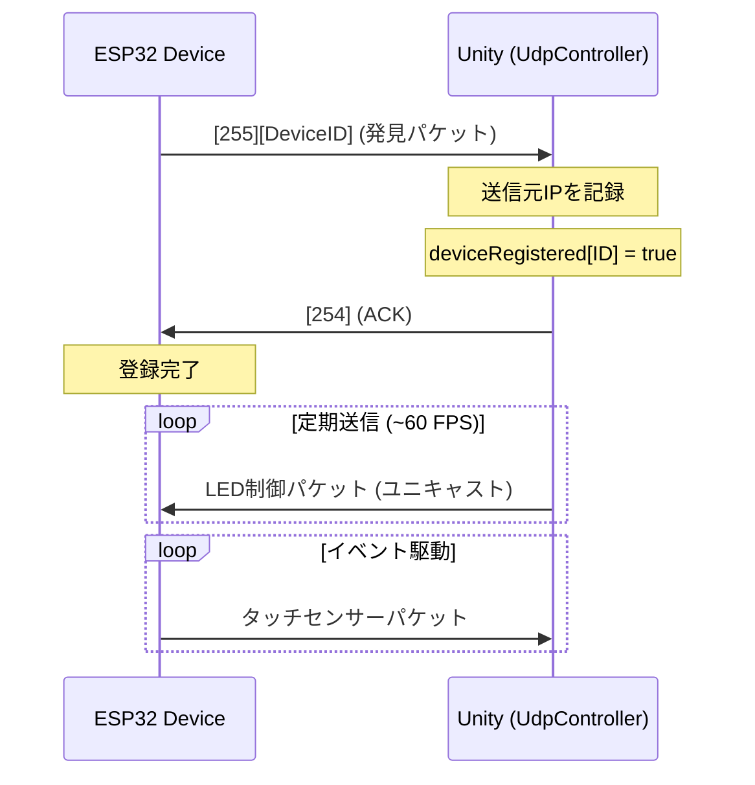
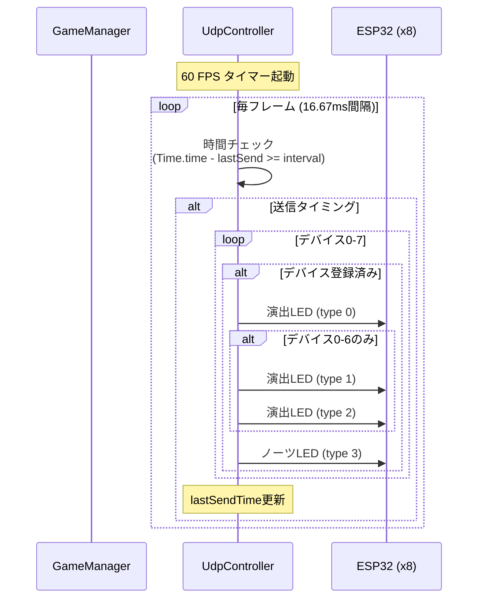
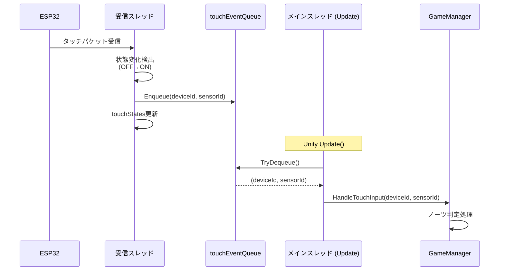

# 3D Rhythm Game - 技術仕様書

**プロジェクト名**: 3d-rhythm-unity  
**バージョン**: 1.0  
**最終更新日**: 2026年3月6日  
**Unity バージョン**: 2022.3 LTS  

---

## 目次

1. [プロジェクト概要](#1-プロジェクト概要)
2. [システムアーキテクチャ](#2-システムアーキテクチャ)
3. [ハードウェア仕様](#3-ハードウェア仕様)
4. [ソフトウェアコンポーネント](#4-ソフトウェアコンポーネント)
5. [データフロー](#5-データフロー)
6. [通信プロトコル](#6-通信プロトコル)
7. [LED制御仕様](#7-led制御仕様)
8. [譜面データフォーマット](#8-譜面データフォーマット)
9. [判定システム](#9-判定システム)
10. [デバッグモード](#10-デバッグモード)
11. [パフォーマンス最適化](#11-パフォーマンス最適化)
12. [既知の問題と対策](#12-既知の問題と対策)
13. [開発・デバッグガイド](#13-開発デバッグガイド)

---

## 1. プロジェクト概要

### 1.1 コンセプト

本プロジェクトは、**リアルタイムLED演出** と **物理タッチセンサー** を組み合わせた3Dリズムゲームです。チュートリアル曲と本番曲を順番に再生し、ゲーム内ノーツの判定結果に応じてフィールド内のLEDモジュールや外部デバイスをリアルタイムで制御します。

### 1.2 主要機能

- **2種類のノーツタイプ**
  - **Touchノーツ**: タップ操作で判定
  - **Connectノーツ**: ドラッグ操作で判定
  
- **リアルタイムLED演出**
  - ノーツ用LED: 470個 (タッチ/コネクトノーツの状態を表示)
  - 演出用LED: 最大10,800個 (90ストリップ × 120 LED)
  - RenderTextureベースの映像連動演出

- **外部ハードウェア連携**
  - ESP32デバイス (最大8台) とUDP通信
  - 各デバイス5個のタッチセンサー (合計40タッチポイント)
  - リアルタイムセンサーフィードバック

- **音楽再生**
  - CRI ADX2対応
  - DSP時刻ベースの高精度タイミング制御
  - VideoPlayer連動による映像演出

### 1.3 技術スタック

- **開発環境**: Unity 2022.3 LTS
- **言語**: C# 
- **音響ミドルウェア**: CRI ADX2
- **通信**: UDP (ブロードキャスト)
- **非同期処理**: AsyncGPUReadback, Threading
- **外部ハードウェア**: ESP32 (Arduino)

---

## 2. システムアーキテクチャ

### 2.1 全体構成図



### 2.2 コンポーネント階層

```
GameManager (シングルトン)
├─ ObjectRelocation (ノーツプール管理)
├─ UdpController (通信統括)
├─ VideoPlayer (演出映像)
└─ AudioSource (CRI ADX2)

各ノーツオブジェクト
├─ TouchNotes_Flag (タッチ判定)
├─ ConnectNotes_Position (ドラッグ位置)
├─ Mugyu_LEDPerformance (Touch演出)
│   └─ LEDMatrixGenerator
└─ Connect_LEDPerformance (Connect演出)
    └─ ConnectLEDGenerator

演出システム
├─ RenderTextureSampler
│   └─ PerfLeds (演出LEDバッファ)
└─ NoteLeds (ノーツLEDバッファ)
```

---

## 3. ハードウェア仕様

### 3.1 ESP32デバイス構成

| 項目 | 仕様 |
|------|------|
| デバイス数 | 最大8台 (ID: 0-7) |
| 通信方式 | UDP (Wi-Fi) |
| 受信ポート | 8888 |
| 送信ポート | 9999 |
| ネットワーク | ブロードキャスト (デフォルト: 192.168.0.255) |

### 3.2 LED構成

#### 3.2.1 ノーツ用LED

| 項目 | 数量 | 用途 |
|------|------|------|
| MUGU LED (Touchノーツ) | 64個/ノーツ | タッチノーツの状態表示 |
| CON LED (Connectノーツ) | 30個/ノーツ | コネクトノーツの状態表示 |
| 総MUGU配置数 | 40個所 | ゲームフィールド内配置 |
| 総CON配置数 | 40個所 | ゲームフィールド内配置 |
| **合計ノーツLED** | **470個** | |

#### 3.2.2 演出用LED

| 項目 | 仕様 |
|------|------|
| ストリップ数 | 90本 |
| LED/ストリップ | 120個 |
| 総LED数 | 10,800個 |
| データサイズ | 32,400バイト (120 LED × 3バイトRGB × 90) |
| 配置 | 3層構造 (各層30ストリップ) |
| 配線方式 | ジグザグ配置 (偶数: 上→下, 奇数: 下→上) |

**デバイス別LED割り当て**:
- デバイス 0-6: 各480個 (4ストリップ × 120 LED)
- デバイス 7: 240個 (2ストリップ × 120 LED)

### 3.3 タッチセンサー

| 項目 | 仕様 |
|------|------|
| センサー数/デバイス | 5個 |
| 総センサー数 | 40個 (8台 × 5) |
| レーン対応 | 0-16までの譜面レーン |
| 入力方式 | 容量式タッチセンサー |
| サンプリングレート | ~60Hz |

---

## 4. ソフトウェアコンポーネント

### 4.1 GameManager

**役割**: ゲーム全体の進行制御

#### 主要機能

- **ゲームフロー制御**
  - チュートリアル → 本番の順次実行
  - 譜面データの読み込み (`LoadNotesFromJson`)
  - ノーツ生成タイミング制御 (`MusicPlayer` コルーチン)

- **判定処理**
  - `TouchNotes_judge()`: Touchノーツの判定 (Perfect/Good/Miss)
  - `ConnectNotes_judge()`: Connectノーツの判定 (ドラッグ検出)

- **スコア管理**
  - Perfect/Good/Miss のカウント
  - 判定結果のログ出力

#### 重要パラメータ

```csharp
public bool autoStart = false;          // 自動開始フラグ
public bool isDebugMode = false;        // デバッグモード
public VideoPlayer videoPlayer;         // 演出映像
public AudioSource Game_MusicSource;    // 音楽ソース
```

#### データ構造

```csharp
// 譜面データ
[System.Serializable]
public class NoteData {
    public float time;   // ノーツ出現時間 (秒)
    public int lane;     // レーンID (0-16)
    public string type;  // "touch" or "connect"
}

// 実行時ノーツ状態
public class ActiveNote {
    public GameObject NoteObject;
    public NoteData Data;
    public bool IsUsed;  // 判定済みフラグ
    public TouchNotes_Flag FlagComponent;
}
```

### 4.2 ObjectRelocation

**役割**: ノーツオブジェクトの配置とプール管理

#### 主要機能

- JSON (`Resources/object_positions_*.json`) からノーツ座標を読み込み
- ノーツプレハブの事前生成 (オブジェクトプーリング)
- ラウンドロビン方式でノーツ提供 (`GetNextAvailableNote`)

#### プレハブマッピング

```csharp
[System.Serializable]
public class PrefabMapping {
    public string originalName;  // JSONでの名前
    public GameObject newPrefab; // Unityプレハブ
    public string noteType;      // "touch" or "connect"
}
```

### 4.3 UdpController

**役割**: LED制御とタッチセンサー通信の統括

#### 主要機能

1. **LED送信**
   - ノーツLEDデータ送信 (470個 × 3バイト)
   - 演出LEDデータ送信 (デバイスごとに480個 or 240個)
   - 送信レート制御 (デフォルト: 60 FPS)

2. **タッチセンサー受信**
   - バックグラウンドスレッドで受信
   - GC対策 (Socket.ReceiveFrom使用)
   - デバイス検出とステータス監視

3. **デバイス管理**
   - 自動デバイス登録
   - 生存確認 (最終通信時刻の監視)
   - ステータス表示更新

#### ネットワーク設定

```csharp
public string broadcastAddress = "192.168.0.255";
public int espPort = 8888;    // ESP32受信ポート
public int unityPort = 9999;  // Unity受信ポート
public int udpFps = 60;       // 送信頻度
```

#### パケット構造

**LED制御パケット (Unity → ESP32)**
```
[0]: デバイスID (0-7)
[1]: データタイプ (0: ノーツLED, 1: 演出LED)
[2-N]: RGBデータ (各LED 3バイト)
```

**タッチセンサーパケット (ESP32 → Unity)**
```
[0]: デバイスID (0-7)
[1]: パケットタイプ (0x01: タッチ, 0x02: 発見)
[2-6]: センサー状態 (5バイト, 各1ビット)
```

### 4.4 RenderTextureSampler

**役割**: VideoPlayerの映像をLEDデータに変換

#### 処理フロー

1. VideoPlayerの準備完了を待機 (`VideoPlayer.isPrepared`)
2. RenderTextureを AsyncGPUReadback で非同期読み取り
3. Texture2D のピクセルデータを `PerfLeds.perfLedData` に書き込み
4. ジグザグ配置の補正 (偶数: 上→下, 奇数: 下→上)

#### パフォーマンス最適化

- **AsyncGPUReadback**: GPUからCPUへの非同期転送
- **GC対策**: テクスチャの使いまわし
- **準備待機**: VideoPlayerのデコード完了を確認

```csharp
public RenderTexture sourceRenderTexture;  // 入力
public PerfLeds targetPerfLeds;            // 出力
public VideoPlayer sourceVideoPlayer;      // 同期用
public int totalStrips = 90;
public int ledsPerStrip = 120;
```

### 4.5 PerfLeds

**役割**: 演出用LEDの最終データバッファ

#### データ構造

```csharp
// 32,400バイト (90ストリップ × 360バイト)
// 各ストリップ: 120 LED × 3バイト(RGB)
public byte[] perfLedData;
```

#### レイヤー構成

```
第1層: ストリップ 0-29   (バイト 0-10799)
第2層: ストリップ 30-59  (バイト 10800-21599)
第3層: ストリップ 60-89  (バイト 21600-32399)
```

### 4.6 NoteLeds

**役割**: ノーツ用LEDの管理

#### LED配置

```csharp
private const int NUM_MUGU_LEDS = 64;  // Touchノーツ LED数
private const int NUM_CON_LEDS = 30;   // Connectノーツ LED数
private const int NUM_DEVICES = 8;     // デバイス数
private const int NUM_TOUTCH = 5;      // センサー/デバイス

// [デバイスID][LEDインデックス]
private Color32[,] ledColors;
```

#### デバッグモード機能

- ループ点灯: 指定レーンが緑色で点灯
- タッチ反応: タッチで赤色に変化
- 全消灯: 黒色で消灯

### 4.7 Mugyu_LEDPerformance / Connect_LEDPerformance

**役割**: ノーツごとのLED演出制御

#### 共通インターフェース

```csharp
void SetLEDGenerate();              // LED行列の初期化
void SetAllLEDColor(Color color);   // 全LED色変更
```

#### 状態遷移 (Touchノーツ例)

```
待機 (黒) → アプローチ (青点滅) → 判定 (緑/黄/赤) → フェードアウト
```

### 4.8 TouchNotes_Flag

**役割**: タッチ入力の検出とフラグ管理

```csharp
public bool TouchFlag { get; private set; }  // タッチ状態
public void SetClicked();                    // タッチ登録
public void ResetFlag();                     // フラグクリア
```

### 4.9 ConnectNotes_Position

**役割**: ドラッグ位置の検出

```csharp
public Vector3 localPos;  // ローカル座標
void GetMouseXOnCubeMM(GameObject target);  // Ray計算
```

---

## 5. データフロー

### 5.1 起動からゲーム開始まで



### 5.2 ノーツ判定フロー (Touch)



### 5.3 演出LED更新フロー



---

## 6. 通信プロトコル

### 6.1 UDP通信仕様

#### 6.1.1 通信パラメータ

| 項目 | 値 |
|------|-----|
| プロトコル | UDP (User Datagram Protocol) |
| ESP32受信ポート | 8888 |
| Unity受信ポート | 9999 |
| ブロードキャストアドレス | 192.168.0.255 (設定可能) |
| 送信頻度 | 1-120 FPS (デフォルト: 60 FPS) |
| 最大デバイス数 | 8台 (ID: 0-7) |

#### 6.1.2 パケット一覧

| 方向 | パケット種別 | サイズ | 頻度 | 説明 |
|------|-------------|--------|------|------|
| Unity → ESP32 | 演出LED (type 0) | 2 + 1,440バイト | ~60 FPS | 演出LED 480個 (Dev 0-6) / 240個 (Dev 7) |
| Unity → ESP32 | 演出LED (type 1) | 2 + 1,440バイト | ~60 FPS | 演出LED 480個 (Dev 0-6のみ) |
| Unity → ESP32 | 演出LED (type 2) | 2 + 1,440バイト | ~60 FPS | 演出LED 480個 (Dev 0-6のみ) |
| Unity → ESP32 | ノーツLED (type 3) | 2 + 1,410バイト | ~60 FPS | ノーツLED 470個 (全デバイス) |
| Unity → ESP32 | 明るさ設定 (type 100) | 4バイト | オンデマンド | 演出・ノーツLEDの明るさ |
| Unity → ESP32 | ACK応答 | 1バイト | デバイス発見時 | デバイス登録確認 |
| ESP32 → Unity | デバイス発見 | 2バイト | 起動時/定期 | デバイス自己紹介 |
| ESP32 → Unity | タッチセンサー | 6バイト | イベント駆動 | センサー状態通知 |

### 6.2 パケットフォーマット詳細

#### 6.2.1 演出LED制御パケット (Unity → ESP32)

**パケット構造**
```
[0]: デバイスID (0-7)
[1]: データタイプ (0, 1, 2)
[2-N]: RGBデータ (LED数 × 3バイト)
```

**データタイプ別の内容**

| Type | 対象ストリップ | LED数 | データサイズ | 備考 |
|------|--------------|-------|-------------|------|
| 0 | ストリップ 0-3 | 480個 (Dev 0-6)<br>240個 (Dev 7) | 1,440バイト<br>720バイト | デバイス7は2ストリップのみ |
| 1 | ストリップ 4-7 | 480個 | 1,440バイト | デバイス0-6のみ送信 |
| 2 | ストリップ 8-11 | 480個 | 1,440バイト | デバイス0-6のみ送信 |

**ストリップ配置マッピング**

各デバイスは最大12ストリップ（デバイス7は6ストリップ）を制御：

```
デバイス0: 物理ストリップID 0, 9, 18, 27, 36, 45, 54, 63, 72, 81, 3, 12
デバイス1: 物理ストリップID 21, 30, 39, 48, 57, 66, 75, 84, 6, 15, 24, 33
デバイス2: 物理ストリップID 42, 51, 60, 69, 78, 87, 1, 10, 19, 28, 37, 46
デバイス3: 物理ストリップID 55, 64, 73, 82, 4, 13, 22, 31, 40, 49, 58, 67
デバイス4: 物理ストリップID 76, 85, 7, 16, 25, 34, 43, 52, 61, 70, 79, 88
デバイス5: 物理ストリップID 2, 11, 20, 29, 38, 47, 56, 65, 74, 83, 5, 14
デバイス6: 物理ストリップID 23, 32, 41, 50, 59, 68, 77, 86, 8, 17, 26, 35
デバイス7: 物理ストリップID 44, 53, 62, 71, 80, 89
```

**RGBデータ順序**
```
各LED: 3バイト [R, G, B]
値範囲: 0-255
順序: ストリップ内はインデックス0-119順
```

#### 6.2.2 ノーツLED制御パケット (Unity → ESP32)

**パケット構造**
```
[0]: デバイスID (0-7)
[1]: データタイプ (3)
[2-1411]: RGBデータ (470個 × 3バイト)
```

**LED配置**
- MUGU LED: 各ノーツ64個
- CON LED: 各ノーツ32個  
- 総計: 470個/デバイス

**データ順序**
```
NoteLeds.GetLedColor(deviceId, ledIndex) の順序で格納
ledIndex: 0-469
各LED: [R, G, B] 3バイト
```

**ゲーム内IDとハードIDの対応**
> 修正メモ: この表を変えたら、`NoteLeds.cs` の `ConvertNoteIdToHard()` / `ConvertNoteIdToGame()` と、`GameManager.cs` の `HandleTouchInput()`・`laneCooldowns` 初期化も同時に更新すること。

| 系統-ID | ハードID (ledIndex) | ゲーム内ID |
|---------|--------------------|------------|
| 0-0     | 0                  | 0          |
| 0-1     | 1                  | 1          |
| 0-2     | 2                  | 2          |
| 0-3     | 3                  |            |
| 0-4     | 4                  |            |
| 1-0     | 5                  |            |
| 1-1     | 6                  |            |
| 1-2     | 7                  |            |
| 1-3     | 8                  |            |
| 1-4     | 9                  |            |
| 2-0     | 10                 |            |
| 2-1     | 11                 |            |
| 2-2     | 12                 |            |
| 2-3     | 13                 |            |
| 2-4     | 14                 |            |
| 3-0     | 15                 | 3          |
| 3-1     | 16                 | 4          |
| 3-2     | 17                 | 5          |
| 3-3     | 18                 | 6          |
| 3-4     | 19                 | 7          |
| 4-0     | 20                 |            |
| 4-1     | 21                 |            |
| 4-2     | 22                 |            |
| 4-3     | 23                 |            |
| 4-4     | 24                 |            |
| 5-0     | 25                 |            |
| 5-1     | 26                 | 8          |
| 5-2     | 27                 |            |
| 5-3     | 28                 |            |
| 5-4     | 29                 |            |
| 6-0     | 30                 |            |
| 6-1     | 31                 |            |
| 6-2     | 32                 |            |
| 6-3     | 33                 |            |
| 6-4     | 34                 |            |
| 7-0     | 35                 | 9          |
| 7-1     | 36                 |10          |
| 7-2     | 37                 |            |
| 7-3     | 38                 |            |
| 7-4     | 39                 |            |

#### 6.2.3 明るさ設定パケット (Unity → ESP32)

**パケット構造**
```
[0]: ブロードキャストID (255)
[1]: パケットタイプ (100)
[2]: 演出LED明るさ (0-255)
[3]: ノーツLED明るさ (0-255)
```

**送信方法**
```csharp
UdpController.SendBrightness(byte perf, byte notes);
```

**適用範囲**
- 全デバイスに対してブロードキャスト送信
- ESP32側でPWM制御に使用

#### 6.2.4 デバイス発見パケット (ESP32 → Unity)

**パケット構造**
```
[0]: ブロードキャストID (255)
[1]: デバイスID (0-7)
```

**送信タイミング**
- ESP32起動時
- 定期的な再通知（実装依存）
- ネットワーク再接続時

**Unityの処理フロー**
1. パケット受信
2. 送信元IPアドレスを記録
3. デバイス登録 (`deviceRegistered[ID] = true`)
4. ACK応答を返信
5. 以降、ユニキャストで通信

#### 6.2.5 ACK応答パケット (Unity → ESP32)

**パケット構造**
```
[0]: ACK識別子 (254)
```

**送信タイミング**
- デバイス発見パケット受信時
- 送信先: 発見されたデバイスのIPアドレス（ユニキャスト）

**ESP32の処理**
- ACK受信を確認してデバイス登録完了
- 以降、LED制御パケットを受信可能

#### 6.2.6 タッチセンサーパケット (ESP32 → Unity)

**パケット構造**
```
[0]: デバイスID (0-7)
[1-5]: センサー0-4の状態 (各1バイト)
       1 = タッチON
       0 = タッチOFF
```

**送信タイミング**
- センサー状態変化時（イベント駆動）
- 定期的な状態通知（実装依存）

**Unityの処理フロー**
1. バックグラウンドスレッドで受信
2. 状態変化（OFF→ON）を検出
3. `touchEventQueue` にエンキュー
4. メインスレッドで `GameManager.HandleTouchInput()` 呼び出し

### 6.3 通信フロー

#### 6.3.1 デバイス登録シーケンス



#### 6.3.2 LED更新サイクル



#### 6.3.3 タッチ入力処理フロー



### 6.4 エラーハンドリング

#### 6.4.1 送信エラー

**発生条件**
- デバイスのネットワーク切断
- IPアドレス変更
- パケットロス

**対策**
```csharp
try {
    sendClient.Send(packet, length, targetEndPoint);
}
catch (Exception e) {
    Debug.LogError($"Error sending to Device {deviceId}: {e.Message}");
    deviceRegistered[deviceId] = false;  // 登録解除
    // 次回の発見パケットで自動再登録
}
```

#### 6.4.2 受信エラー

**予期しないパケットサイズ**
```csharp
if (receivedBytes != EXPECTED_SIZE) {
    // 無視（ログ出力のみ）
    // デバイスは再送信で自動回復
}
```

**範囲外デバイスID**
```csharp
if (deviceId < 0 || deviceId >= NUM_DEVICES) {
    // 無視（不正なパケット）
}
```

### 6.5 パフォーマンス最適化

#### 6.5.1 GC対策

**Socket.ReceiveFrom の使用**
```csharp
// GC発生する実装 (×)
byte[] data = receiveClient.Receive(ref anyIP);  // 毎回newでGC発生

// GC回避実装 (○)
byte[] receiveBuffer = new byte[64];  // 事前確保
int length = receiveSocket.ReceiveFrom(receiveBuffer, ref endPoint);
```

**パケットバッファの再利用**
```csharp
// 事前確保（Start時）
private byte[] perfPacket = new byte[2 + NUM_PERF_LEDS * 3];
private byte[] notePacket = new byte[2 + NUM_NOTE_LEDS * 3];

// 送信時に再利用（newしない）
perfPacket[0] = deviceId;
perfPacket[1] = type;
Array.Copy(sourceData, 0, perfPacket, 2, dataLength);
sendClient.Send(perfPacket, length, endPoint);
```

#### 6.5.2 マルチスレッド設計

**受信スレッド**
```csharp
private Thread receiveThread;
receiveThread = new Thread(ReceiveData);
receiveThread.IsBackground = true;  // アプリ終了時に自動終了
receiveThread.Start();
```

**スレッドセーフキュー**
```csharp
private ConcurrentQueue<(int deviceId, int sensorId)> touchEventQueue;
```

**メインスレッドでのキュー処理**
```csharp
void Update() {
    while (touchEventQueue.TryDequeue(out var touchEvent)) {
        // メインスレッドで安全に処理
        GameManager.Instance.HandleTouchInput(...);
    }
}
```

#### 6.5.3 送信頻度制御

**設定可能範囲**
```csharp
[Range(1, 120)]
public int udpFps = 60;  // Inspector で調整可能
```

**実装**
```csharp
private float udpInterval = 1f / 60f;
private float lastUdpSendTime = 0f;

void Update() {
    if (Time.time - lastUdpSendTime >= udpInterval) {
        SendAllLedData();
        lastUdpSendTime = Time.time;
    }
}
```

### 6.6 デバイスステータス監視

#### 6.6.1 監視項目

| 項目 | 型 | 説明 |
|------|-----|------|
| deviceRegistered[ID] | bool | デバイス登録状態 |
| lastDiscoveryTime[ID] | float | 最終発見時刻 (Time.time) |
| lastTouchTime[ID] | float | 最終タッチパケット受信時刻 |
| lastTouchTimePerSensor[ID][sensor] | float | センサーごとの最終タッチ時刻 |

#### 6.6.2 ステータス表示

**色分けルール**
```
緑: 0.5秒以内に通信
黄: 0.5-2.0秒前に通信
赤: 2.0秒以上通信なし
```

**表示内容**
```
Dev 0: [REG] Discovery: 123.4. LastTouch: 125.6 Sensors: S0:125.1 S1:N/A ...
```

### 6.7 通信プロトコルのテスト

#### 6.7.1 テストパターン送信

```csharp
// 全LED白色点灯
UdpController.InitializeTestData();
```

#### 6.7.2 デバッグコマンド

**タッチ状態確認**
```
Spaceキー押下 → Console にタッチ状態表示
```

**ステータス確認**
```
Inspector → UdpController
  - deviceRegistered[]: デバイス登録状態
  - touchStates[][]: リアルタイムセンサー状態
```

#### 6.7.3 ネットワーク診断

**Windowsコマンド**
```powershell
# UDP送信確認
netstat -an | Select-String "8888"

# UDP受信確認
netstat -an | Select-String "9999"
```

**Unityコンソールログ**
```
正常: "Device X 発見！ IP: 192.168.0.Y"
正常: "Sent Data"
異常: "Error sending to Device X: ..."
異常: "Unexpected packet size: ..."
```

---

## 7. LED制御仕様

### 7.1 色定義

| 状態 | 色 | 用途 |
|------|-----|------|
| 待機 | 黒 (0,0,0) | ノーツ待機中 |
| アプローチ | 青点滅 | タイミング案内 |
| Perfect | 緑 (0,255,0) | 完璧な判定 |
| Good | 黄 (255,255,0) | 良い判定 |
| Miss | 赤 (255,0,0) | 失敗判定 |
| デバッグループ | 緑 (0,255,0) | デバッグモード |
| デバッグタッチ | 赤 (255,0,0) | デバッグタッチ |

### 7.1.1 Touch判定後トレイル演出

- Touchノーツの判定確定時（Perfect / Good / Miss）に、同一レーンのCON LED（30LED）へ流れるノーツ演出を適用する。
- トレイル色は判定色をそのまま使用し、HSV変換による色相変更は行わない。
- トレイルは時間減衰（fade out）とガウシアン分布で先頭位置を表現し、一定時間後に自動消灯する。

### 7.2 LED配置マッピング

#### ノーツLED

```
ゲーム内ID → ハードID は固定テーブルで管理する。

例:
  0 → (0, 0)
  1 → (0, 1)
  2 → (0, 2)
  3 → (3, 0)
  4 → (3, 1)
  5 → (3, 2)
  6 → (3, 3)
  7 → (3, 4)
  8 → (5, 1)
  9 → (7, 0)
  10 → (7, 1)
```

#### 演出LED (ストリップ配置)

```
レイヤー配置 (時計回り):
  第1層: ストリップ 0-29
  第2層: ストリップ 30-59
  第3層: ストリップ 60-89

ジグザグ配線:
  偶数ストリップ: Index 0 (上) → 119 (下)
  奇数ストリップ: Index 119 (下) → 0 (上)
```

### 7.3 RenderTexture マッピング

```
RenderTexture解像度: 90 × 120ピクセル
  X軸 (幅): ストリップID (0-89)
  Y軸 (高さ): LED位置 (0-119)

ピクセル色 → LED色:
  R: 0-255 → RED
  G: 0-255 → GREEN
  B: 0-255 → BLUE
```

---

## 8. 譜面データフォーマット

### 8.1 JSONフォーマット

**ファイルパス**: `Assets/Resources/*.json`

#### 構造

```json
{
  "notes": [
    {
      "time": 2.5,
      "lane": 8,
      "type": "touch"
    },
    {
      "time": 3.0,
      "lane": 12,
      "type": "connect"
    }
  ]
}
```

#### フィールド定義

| フィールド | 型 | 説明 | 範囲 |
|-----------|-----|------|------|
| time | float | 出現時間 (秒) | 0.0~ |
| lane | int | レーンID | 0-16 |
| type | string | ノーツタイプ | "touch" or "connect" |

### 8.2 配置データフォーマット

**ファイルパス**: `Assets/Resources/object_positions_*.json`

```json
{
  "objects": [
    {
      "prefabName": "touch_notes_0",
      "position": {"x": 1.5, "y": 0.5, "z": 2.0},
      "rotation": {"x": 0, "y": 90, "z": 0},
      "scale": {"x": 1, "y": 1, "z": 1}
    }
  ]
}
```

---

## 9. 判定システム

### 9.1 Touch判定

#### タイミング判定幅

```csharp
const float PERFECT_RANGE = 0.05f;  // ±50ms
const float GOOD_RANGE = 0.15f;     // ±150ms
```

#### 判定ロジック

```csharp
float timeDiff = Mathf.Abs(currentTime - noteTime);

if (timeDiff <= PERFECT_RANGE) {
    // Perfect判定
    score += 100;
    SetLEDColor(Color.green);
}
else if (timeDiff <= GOOD_RANGE) {
    // Good判定
    score += 50;
    SetLEDColor(Color.yellow);
}
else {
    // Miss判定
    SetLEDColor(Color.red);
}
```

### 9.2 Connect判定

#### 要件

- ドラッグ開始検出
- ドラッグ継続確認
- 必要時間の充足

```csharp
const float REQUIRED_TIME = 3.0f;   // 必要ドラッグ時間 (秒)
const float JUDGE_END_OFFSET = 1.0f; // 許容オーバー時間
```

#### 状態遷移

```
待機 → ドラッグ開始 → ドラッグ中 → 完了 or Miss
```

---

## 10. デバッグモード

### 10.1 有効化方法

```csharp
// GameManager Inspector
public bool isDebugMode = true;
```

### 10.2 デバッグ機能

#### ノーツLEDテスト

- **ループ点灯**: レーン0-10を順番に緑色で点灯
- **タッチ反応**: タッチで赤色に変化
- **自動消灯**: タッチ解除で黒色に戻る

#### UDPテストパターン

```csharp
UdpController.InitializeTestData();
```

- 全LED白色点灯
- デバイス通信確認

#### ステータス表示

リアルタイムでシステム状態を画面左上に表示します。

**デバイス通信状態**
```
--- Device Status (Time.time) ---
Dev [ID]: [登録状態]
  Discovery: [Time.time]s
  LastTouch: [Time.time]s (色付き: 緑=正常, 黄=遅延, 赤=通信途絶)
  Sensors: S0:[Time.time]s S1:... S2:... S3:... S4:...
```

**ノーツ状態**
```
--- Active Notes Status ---
Total: [総ノーツ数], Active: [アクティブ数], Used: [判定済み数]
Touch: [タッチノーツ数], Connect: [コネクトノーツ数]
Spawned Index: [現在生成インデックス] / [総ノーツ数]
Recent Notes:
  [インデックス] T/C Lane:[レーン] Time:[時刻]
  ...（最大10件まで表示）
```

**表示内容の説明**
- **Total**: 譜面に含まれる全ノーツ数
- **Active**: 現在メモリに存在するノーツ数
- **Used**: 既に判定済みのノーツ数
- **Touch / Connect**: タイプ別のノーツ数
- **Spawned Index**: 現在までに生成されたノーツのインデックス
- **Recent Notes**: 現在アクティブで未判定のノーツの詳細（最大10件）
  - `T`: Touchノーツ, `C`: Connectノーツ
  - 色付き表示: シアン=未判定, グレー=判定済み

---

## 11. パフォーマンス最適化

### 11.1 GC対策

#### UdpControllerのSocket使用

```csharp
// Before (GC発生)
byte[] data = receiveClient.Receive(ref remoteEP);

// After (GC回避)
byte[] receiveBuffer = new byte[64];  // 事前確保
int length = receiveSocket.ReceiveFrom(receiveBuffer, ref endPoint);
```

#### パケットバッファの使いまわし

```csharp
private byte[] perfPacket = new byte[2 + NUM_PERF_LEDS * 3];
private byte[] notePacket = new byte[2 + NUM_NOTE_LEDS * 3];
```

#### WaitForSecondsのキャッシング

```csharp
private WaitForSeconds waitHalfSecond = new WaitForSeconds(0.5f);
```

### 11.2 非同期処理

#### AsyncGPUReadback

```csharp
AsyncGPUReadback.Request(sourceRenderTexture, 0, OnCompleteReadback);
```

- GPU → CPU転送を非同期化
- メインスレッドのブロック回避

#### マルチスレッド受信

```csharp
private Thread receiveThread;
receiveThread = new Thread(ReceiveData);
receiveThread.Start();
```

### 11.3 送信頻度制御

```csharp
public int udpFps = 60;  // 送信FPS (1-120)

private float udpInterval = 1f / 60f;
if (Time.time - lastUdpSendTime >= udpInterval) {
    SendAllLedData();
    lastUdpSendTime = Time.time;
}
```

---

## 12. 既知の問題と対策

### 12.1 UDP LED送信不能問題 (2026-03)

#### 症状

LEDにUDPで情報を送れなくなる

#### 根本原因

RenderTextureSamplerコンポーネントの必須パラメータがシーンで未設定

```yaml
未設定項目:
  - sourceRenderTexture
  - targetPerfLeds
  - sourceVideoPlayer
```

#### 影響範囲

1. RenderTextureSampler.Start() で初期化失敗
2. perfLedData が null のまま
3. UdpController が無効化
4. UDP送信不可

#### 修正方法

**SampleScene.unity** の RenderTextureSampler コンポーネントに以下を設定:

```yaml
sourceRenderTexture: {fileID: 8400000, guid: 3303869d23accd3499ca035caf3dac5e}
targetPerfLeds: {fileID: 1913507874}
sourceVideoPlayer: {fileID: 79728332}
```

#### 確認方法

Consoleで以下のログを確認:

```
PerfLeds buffer initialized: 32400 bytes
```

#### 予防策

- コンポーネント構造変更時は、シーン設定も同時更新
- Inspector で `{fileID: 0}` (未設定) がないか確認

### 12.2 デバイス未検出

#### 症状

ESP32デバイスが登録されない

#### 確認項目

1. **ネットワーク設定**
   - PCとESP32が同一ネットワーク
   - ブロードキャストアドレスが正しい

2. **ファイアウォール**
   - UDP 8888, 9999 ポートが開放されている

3. **ESP32側**
   - Wi-Fi接続が確立している
   - 発見パケット送信コードが実装されている

---

## 13. 開発・デバッグガイド

### 13.1 開発環境セットアップ

1. **Unity プロジェクト**
   ```
   Unity 2022.3 LTS以上
   Visual Studio 2022 (C# 開発用)
   ```

2. **CRI ADX2 SDK**
   - `Assets/CRIMW/` にSDK配置
   - CriWare ランタイムとエディタツール

3. **必須パッケージ**
   - Unity Input System
   - Video Player

### 13.2 デバッグワークフロー

#### ステップ1: ノーツ配置確認

```csharp
// ObjectRelocation.cs
Debug.Log($"Loaded {noteObjectPools[type].Count} notes for {type}");
```

#### ステップ2: 譜面データ検証

```csharp
// GameManager.cs
foreach (var note in notesData) {
    Debug.Log($"[{note.time:F2}s] Lane:{note.lane} Type:{note.type}");
}
```

#### ステップ3: UDP通信確認

```csharp
// UdpController.cs (Inspector確認)
deviceRegistered[0-7]  // デバイス登録状態
lastDiscoveryTime      // 最終発見時刻
touchStates           // センサー状態
```

#### ステップ4: LED動作確認

デバッグモード有効化で視覚確認:

```csharp
GameManager.isDebugMode = true;
```

### 13.3 ログ分析

#### 重要ログパターン

```
✓ 正常起動
"PerfLeds buffer initialized: 32400 bytes"
"VideoPlayer is prepared. サンプリングを開始します"

✗ エラー
"RenderTexture または PerfLeds が設定されていません"
"Source Video Player が設定されていません"
```

### 13.4 プロファイリング

#### Unity Profiler

- **CPU Usage**: GameManager.Update, UdpController.SendAllLedData
- **Memory**: GC.Alloc (UDPパケット生成)
- **Rendering**: AsyncGPUReadback完了時間

#### ネットワークモニタリング

```powershell
# Windows: UDP送信確認
netstat -an | Select-String "8888"
netstat -an | Select-String "9999"
```

### 13.5 トラブルシューティング

| 症状 | 原因候補 | 対策 |
|------|---------|------|
| ノーツが出現しない | 譜面データ読み込み失敗 | Console で JSON エラー確認 |
| LEDが光らない | UdpController 未初期化 | Inspector パラメータ確認 |
| 判定がずれる | DSP時刻のオフセット不正 | AudioSettings.dspTime 確認 |
| センサー反応しない | デバイス未登録 | deviceRegistered 配列確認 |
| 映像演出が出ない | RenderTexture 未設定 | RenderTextureSampler設定確認 |

---

## 付録

### A. ファイル構造

```
3d-rhythmgame/
├── Assets/
│   ├── CRIMW/              # CRI ADX2 SDK
│   ├── Scenes/
│   │   └── SampleScene.unity
│   ├── Script/
│   │   ├── GameManager.cs
│   │   ├── UdpController.cs
│   │   ├── RenderTextureSampler.cs
│   │   ├── PerfLeds.cs
│   │   ├── NoteLeds.cs
│   │   ├── ObjectRelocation.cs
│   │   ├── TouchNotes_Flag.cs
│   │   ├── ConnectNotes_Position.cs
│   │   ├── Mugyu_LEDPerformance.cs
│   │   ├── Connect_LEDPerformance.cs
│   │   ├── LEDMatrixGenerator.cs
│   │   └── ConnectLEDGenerator.cs
│   ├── Resources/
│   │   ├── Tutorial_NotesData.json
│   │   ├── Ocahsai_NoteData.json
│   │   ├── object_positions_ochasai.json
│   │   ├── touch_notes.prefab
│   │   └── Connect_module.prefab
│   ├── movie/              # 演出映像
│   └── VideoRenderTexture.renderTexture
├── ProjectSettings/
└── README.md
```

### B. 用語集

| 用語 | 説明 |
|------|------|
| **MUGU** | Touchノーツの別称（むぎゅっと押すイメージ） |
| **CON** | Connectノーツの略称 |
| **DSP時刻** | Digital Signal Processor時刻 (高精度音楽同期用) |
| **AsyncGPUReadback** | UnityのGPU→CPU非同期データ転送API |
| **ジグザグ配置** | LEDストリップの物理配線方式 |
| **デバイス発見** | ESP32の自動検出機能 |
| **オブジェクトプール** | ノーツの事前生成・再利用パターン |

### C. 参考リンク

- [Unity AsyncGPUReadback](https://docs.unity3d.com/ScriptReference/Rendering.AsyncGPUReadback.html)
- [CRI ADX2 SDK Documentation](https://game.criware.jp/)
- [ESP32 UDP通信](https://docs.espressif.com/)

---

**更新履歴**:
- 2026-03-06: 初版作成、UDP LED問題の修正内容を反映
