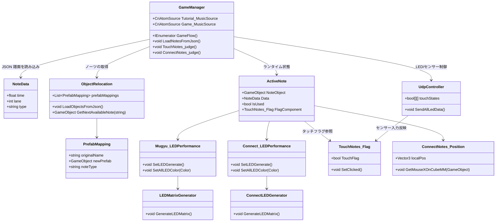

# 3D Rhythm Game プロジェクト引き継ぎガイド

このリポジトリは、リアルタイム LED 演出とタッチ／ドラッグ操作を組み合わせた 3D リズムゲームの Unity プロジェクトです。チュートリアル曲と本番曲を順番に再生し、ゲーム内ノーツの判定結果に応じてフィールド内の LED モジュールや外部デバイスを制御します。本ドキュメントでは、プロジェクトのコード構成とデータの流れを整理し、引き継ぎ担当者が全体像を素早く把握できるようにまとめています。

## 実装のハイライト

- **ゲーム全体の制御**: `GameManager` がチュートリアル→本番の流れ、譜面読み込み、ノーツ生成／判定、スコア集計を統括します。
- **ノーツ生成とプール**: `ObjectRelocation` が `Resources/*.json` からオブジェクトの位置情報を読み込み、ノーツ用プレハブを事前に生成して `GameManager` へ提供します。
- **LED 演出**: 各ノーツには `Mugyu_LEDPerformance`（タッチ）または `Connect_LEDPerformance`（ドラッグ）がアタッチされ、LED 行列 (`LEDMatrixGenerator` / `ConnectLEDGenerator`) を初期化して判定結果に応じた色を出力します。
- **ハードウェア連携**: `UdpController` が LED データのブロードキャスト送信と、外部タッチセンサーからのフィードバック受信を担当し、`TouchNotes_Flag` による判定ロジックと連携します。

## クラス構成図



## システムコンポーネントの役割

### GameManager とノーツ判定

- `GameFlow()` コルーチンでチュートリアル (`Tutorial()`)、本番 (`Game()`) を順番に実行。
- `LoadNotesFromJson()` が `Resources/Tutorial_NotesData.json` や `Ocahsai_NoteData.json` などの譜面ファイルを `NoteData[]` に展開。
- `MusicPlayer()` が CRI Atom Source を再生し、DSP 時刻を基準にノーツ生成タイミングを算出。
- `ActiveNote` 構造体で各ノーツの状態を保持し、`TouchNotes_judge()` と `ConnectNotes_judge()` が判定・スコア加算・LED の状態遷移を担当します。

### オブジェクト配置とノーツプール

- `ObjectRelocation` が `Resources/object_positions*.json` からタッチ／コネクト用のプレハブ座標を読み込み、ゲーム開始前にシーンへ配置します。
- `prefabMappings` で JSON 名称と実際のプレハブを紐付け、各ノーツタイプごとにプール (`noteObjectPools`) を作成。
- `GetNextAvailableNote(type)` が `GameManager` から呼ばれ、該当タイプのノーツオブジェクトをラウンドロビンで返却します。

### LED 表示と演出

- `Mugyu_LEDPerformance`（タッチノーツ）と `Connect_LEDPerformance`（ドラッグノーツ）が、それぞれ `LEDMatrixGenerator`／`ConnectLEDGenerator` を用いて LED 配列を初期化。
- 判定結果に応じて `SetAllLEDColor(Color)` で色を変更し、`UdpController.SendAllLedData()` を介して外部デバイスへ同期します。

### 入力検出

- `TouchNotes_Flag` がマウスクリック（またはタッチセンサーからのシグナル）を受け取り、`GameManager` の判定処理で参照されます。
- `ConnectNotes_Position` がドラッグ中のローカル座標を算出し、`ConnectNotes_judge()` 内でドラッグ開始・完了の判定に利用されます。

### ハードウェア連携 (`UdpController`)

- `broadcastAddress`／`espPort`／`unityPort` を用いて LED 制御用データを UDP ブロードキャストし、最大 10 台のデバイスに配信。
- 受信スレッドでタッチセンサー状態（7ch）を監視し、`touchStates` に反映。必要に応じて `TouchNotes_Flag.SetClicked()` を呼び出してゲーム内判定へ接続します。
- `InitializeTestData()` を使うと、LED へテストパターンを送信可能。

## データファイルとリソース

| 種別 | 代表ファイル | 説明 |
| --- | --- | --- |
| 譜面データ | `Assets/Resources/Tutorial_NotesData.json`<br>`Assets/Resources/Ocahsai_NoteData.json` | `NoteData` 配列。`time`（秒）、`lane`（0〜）、`type`（"touch" / "connect"）を定義。`GameManager` の Inspector でファイル名（拡張子なし）を指定します。 |
| ノーツ配置 | `Assets/Resources/object_positions_ochasai.json` など | `ObjectRelocation` が読み込み、プレハブを配置。`PrefabMapping` で JSON 中の `prefabName` とプレハブを対応付けます。 |
| プレハブ | `Assets/Resources/touch_notes.prefab`<br>`Assets/Resources/Connect_module.prefab` | ノーツ本体と LED 行列。LED 球体マテリアルは `LEDMaterial.mat` を参照。 |

## 実行時シーケンス

```mermaid
flowchart TD
	Awake(ObjectRelocation.Awake / GameManager.Awake) --> Load(ObjectRelocation.LoadObjectsFromJson)
	Load --> Pool[ノーツプール生成]
	Pool --> Start(GameManager.Start)
	Start --> Flow[GameManager.GameFlow]
	Flow --> Tutorial[LoadNotesFromJson(Tutorial) + MusicPlayer]
	Tutorial --> Game[LoadNotesFromJson(Game) + MusicPlayer]
	Game --> Judge[TouchNotes_judge / ConnectNotes_judge]
	Judge --> LED[Mugyu/Connect LEDPerformance]
	LED --> UDP[UdpController.SendAllLedData]
	UDP --> Sensors[タッチセンサー受信]
	Sensors --> Judge
```

## 引き継ぎ時のチェックリスト

- Unity エディタで `GameManager`, `ObjectRelocation`, `UdpController` の Inspector 値（譜面ファイル名、プレハブマッピング、IP 設定など）を確認する。
- `Resources` 内に新しい譜面や配置データを追加する場合は、JSON 形式と文字コード (UTF-8) を合わせる。
- ハードウェア連携を行う場合は、ネットワークのブロードキャストアドレスとポートが正しいか、ファイアウォール設定と合わせて動作確認する。
- LED 演出を変更する際は、`Mugyu_LEDPerformance` / `Connect_LEDPerformance` で色変更後に `UdpController.SendAllLedData()` を呼び出す処理が残っているかを確認する。
- `UdpController` の受信処理はバックグラウンドスレッドで動作するため、アプリ終了時 (`OnDestroy`) までにクライアントをクローズすること。

## 今後の改善アイデア

- 判定結果を UI やログ以外に可視化する仕組み（スコアポップアップ、リザルト画面など）を追加する。
- `UdpController` から `TouchNotes_Flag` への連携方法を拡張し、センサーごとのノーツ割り当て設定を行えるようにする。
- ノーツプールのリセット処理を実装し、曲切り替え後にオブジェクト状態が残らないようにする。
- テスト用の自動判定スクリプトやログ収集機能を追加して、譜面データ変更時のリグレッションチェックを容易にする。

---

質問や追加のドキュメント化が必要な場合は、`Assets/Script/` 内の各コンポーネントを確認しながら本 README をアップデートしてください。
